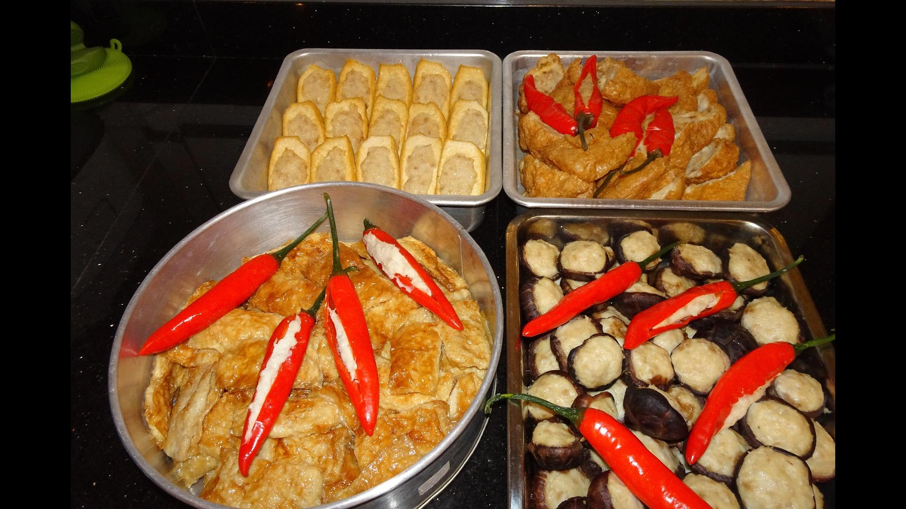

[Back to homepage](https://ah-jia.github.io/)

# HAKKA YONG TAU HU
[Instructional video](https://youtu.be/e3xqpkpum2U)

[Instructional video](https://youtu.be/e3xqpkpum2U)

## Ingredients
- 700 gm fish meat (scraped from any preferred white flesh fish, my favourite is redbelly yellowtail fusilier)  In Chinese is called doufu yu or fanshu yu or huang wei yu
- 4 tbsp tapioca flour (or can use arrowroot flour)
- egg white from 2 eggs
- 4 tsp salt
- 1 tsp white pepper
                    
                    

### Steps
1. Using a food processor, blend all the above ingredients for about 3 minutes.
2. Add 1 cup chilled water and process till paste is smooth and sticky.
3. Chill fish paste in fridge for an hour.
4. Add in 350 gm minced pork plus 2 tbsp fish sauce (good quality at least N40)
5. Mix well with hand.
6. Fill with your favourite items.

This portion is enough to fill:
- 10 tau kwa 
- 10 tau pok
- 30 dried shitake mushrooms
- 1 bitterguord
- 1 sheet bean curd skin (preferably less salt), cut into 24 pieces

[Back to homepage](https://ah-jia.github.io/)
